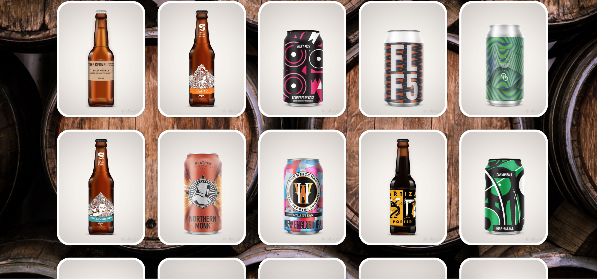
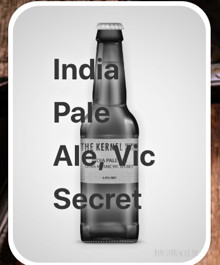
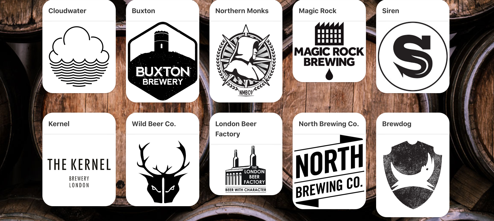
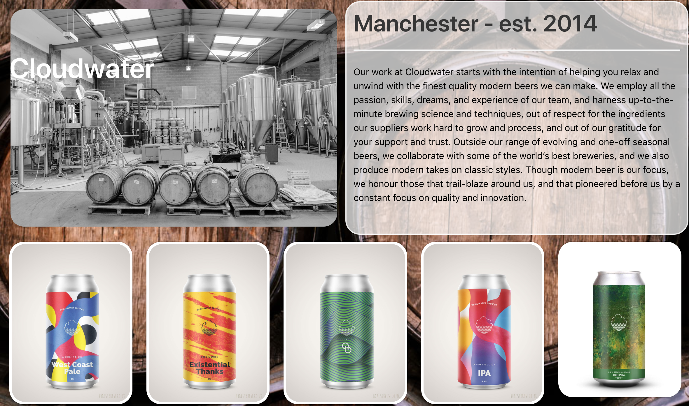
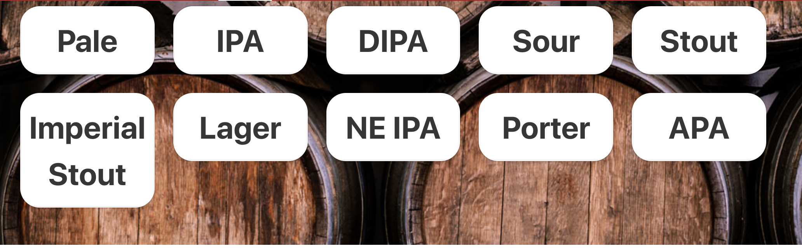
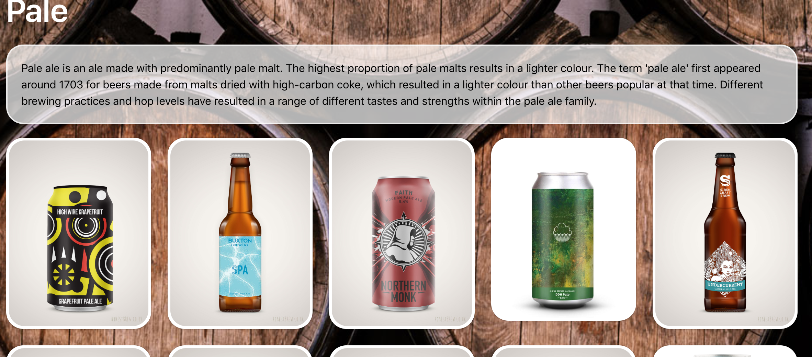

# SEI-Project-4: Craft beer app

### Timeframe
7 Days

### Technologies Used
- HTML
- CSS
- Bulma
- React.js
- Python
- Flask
- MarshMallow
- PonyORM
- Pipenv and yarn
- Git
- Webpack
- PostgreSQL
- Heroku

### Installation
- Clone or download the repo
- yarn and pipenv install to install dependencies
- createdb craftbeer-db to create database using postgress
- yarn run server to run backend
- yarn run client to run front-end

## Overview

A craft beer database built with Python.

## Introduction

The final project of my Software Engineering Course at GA was centered around craft beer.

My job prior to starting the course was in bars, specifically bars that stocked beers from independent traders. I thought this would be an interesting subject to pursue, as well as a tasty one.

This was a solo endeavour.

## Process

We were tasked with building a database with python in the backend, then creating a frontend to display the data. I saw this as an opportunity to challenge myself and really dive into everything I had learnt, so I decided to do this project on my own.

## Backend
At first I decided to start on the backend and construct a model and schema for just the beers I intended to use. I decided to go in-depth on the model and specify many characteristics of the beer. This developed into adding two more models for the breweries and the styles of beer. I thought that this would be a nice feature, to link everything and be able to search in different ways.

### Beers Schema

```
class BeerSchema(Schema):
    id = fields.Int(dump_only=True)
    name = fields.Str(required=True)
    image = fields.Str(required=True)
    brewery = fields.Nested('BrewerySchema', exclude=('beers', 'user'), dump_only=True)
    brewery_id = fields.Int(load_only=True)
    style = fields.Nested('StyleSchema', exclude=('beers',), dump_only=True)
    style_id = fields.Int(load_only=True)
    hops = fields.Str()
    region = fields.Str(required=True)
    abv = fields.Float(required=True)
    price = fields.Float(required=True)
    tasting_notes = fields.Str(required=True)
    user = fields.Nested('UserSchema', exclude=('email', 'beers', 'breweries'))
```

### Breweries Schema

```
class BrewerySchema(Schema):
    id = fields.Int()
    name = fields.Str(required=True)
    logo = fields.Str(required=True)
    image = fields.Str(required=True)
    info = fields.Str(required=True)
    founded = fields.Int(required=True)
    area = fields.Str(required=True)
    beers = fields.Nested('BeerSchema', many=True, exclude=('brewery', 'style'))
    user = fields.Nested('UserSchema', exclude=('email', 'breweries'))
```

### Styles schema

```
class StyleSchema(Schema):
    id = fields.Int(dump_only=True)
    name = fields.Str(required=True)
    info = fields.Str(required=True)
    beers = fields.Nested('BeerSchema', many=True, exclude=('style',))
```

## Frontend

### User / Register / Login

### Beer Collection

image of all beers



Just like the previous project, I allowed for there to be a page containing all of the seeded beers, with a hover state over them that greyed out the image then showed the beer name, ABV and price.



### Beer Show

In order for me to display both the info about the beer and include the brewery, i had to use a request promise to make two request to my backend. One to get the information about the beer, then the other to grab the brewery name and a bit of info about it that would then be displayed.


```
render() {
  if(!this.state.beer) return null
  return(
    <section className="section">
      <div className="container pad">
        <div className="columns is-multiline">
          <div className="column is-half-desktop is-full-tablet">
            <figure className="image">
              
            </figure>
          </div>
          <div className="column info is-half-desktop is-full-tablet">
            <div className="level-left">
              <h1 className="title is-1 level-right">{this.state.beer.name}</h1>
            </div>
            <div className="level-left">
              <h3 className="subtitle is-3">{this.state.beer.brewery.name}
              </h3>
              <hr />
            </div>
            <div className="level-left">
              <h3 className="subtitle is-3">{this.state.beer.region}  •  {this.state.beer.abv}%  •  £{this.state.beer.price}</h3>
            </div>
            <hr />
            <p>{this.state.beer.tasting_notes}</p>
          </div>
        </div>
      </div>
    </section>
  )
}
```

### Brewery Collection

Here was where I had my select collection of breweries that i used. I wanted to keep it simple, so i only had the breweries i chose and didn't allow for other breweries to be added in. This took the same format as the beer collection, but without the hover state.



### Brewery Show

Here was were used an axios request to get the brewery name, an image from the brewery, where they were located, when they were established, a little bit of info, and a collection of beers that they had that were in my seeds. When the user eventually added a beer it would be then added to this page, if it was from the brewery of course.



### Style Collection

Following in the same format as before, all the styles i used were displayed in an easy to access manor. Selecting one of these styles would bring up all the beers in the database under that style, making it easier to search for beers.



### Style Show



### Add a Beer

The add a beer section allowed the user, once logged in, to add a beer (that was from one of the specified breweries and styles). I incorporated the React-Select function to allow the user to select a brewery and a style from the drop list provided. I had to create two different handleChange properties here with handleStyleSelect and handleBrewerySelect

```
handleBrewerySelect(e) {
  const data = { ...this.state.data, brewery_id: e.value }
  this.setState({ data })
}

handleStyleSelect(e) {
  const data = { ...this.state.data, style_id: e.value }
  this.setState({ data })
}
```

After the user had filled in all the info, they were able to successfully add a beer into the database. This would then show up at the bottom of the beer collection.
